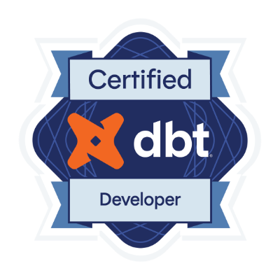

# Rafael Silva de Oliveira

**Analytics Engineer building reliable data products and modern data platforms**

Brazil · LATAM · Open to remote international opportunities

## About me

I am a LATAM-based Analytics Engineer with 3+ years of experience who turns complex business questions into reliable, maintainable data products. I combine analytics engineering, data modeling, cloud infrastructure, and software engineering to build systems that are useful to the business and clear to the people who maintain them.

I currently work at **INSIDER Store**, Brazil's leading online apparel retailer. I am open to remote international opportunities as an **Analytics Engineer** or **Data Engineer**.

## Main stack

## Career highlights

💰 Led cost-reduction initiatives at Insider Store that delivered approximately **USD 4,000/month in Looker dashboard optimizations** and **USD 1,200/month in dbt pipeline efficiencies**.

📊 Conducted cultural-fit analysis across hiring and turnover trends at **iFood**, Brazil's largest tech company, driving strategic discussions with HR leadership.

🏗️ Refactored **three complete data domains spanning 90+ tables** across finance, supply chain, and logistics. Applied Kimball dimensional modeling and separated staging, intermediate, mart, and curated layers to improve discoverability and accelerate onboarding for business users and new hires.

## How I work

🎯 **Business first:** I prioritize aligning requirements and goals with stakeholders before building the data product.

🧱 **Maintainable by design:** I separate concerns, model domains clearly, and optimize for long-term ownership.

📝 **Documented and testable:** I treat documentation, validation, and observability as part of the product.

🤝 **Collaborative:** I work closely with business partners and engineers to turn shared context into dependable solutions.

## Highlighted projects

### [Tshark Streaming Ingestion](https://github.com/Rafa658/tshark-streaming-ingestion)

A streaming pipeline that sends packet-capture data through MQTT into PostgreSQL and TimescaleDB. It combines Python ingestion with a memory-efficient Go worker, at-least-once delivery, bounded backpressure, Prometheus metrics, Grafana dashboards, and end-to-end validation. Built using Spec-Driven Development (SDD).

### [Bruin Aviation Data Pipeline](https://github.com/Rafa658/bruin-data-pipeline)

A production-oriented analytics pipeline for aviation performance data using Bruin and DuckDB. It implements raw, staging, intermediate, and mart layers; dimensional models; business-rule validation; referential-integrity checks; and operational KPI calculations.

### [GCP Serverless API Infrastructure](https://github.com/Rafa658/gcp-api-terraform)

Terraform infrastructure for a secure serverless API on Google Cloud. It provisions private networking, Cloud SQL for PostgreSQL, Secret Manager, Artifact Registry, least-privilege IAM, and Cloud Run.

## Certifications

**dbt Certified Developer**

## Languages & education

- **B.Sc. in Mechanical Engineering** — Aeronautics Institute of Technology (ITA), Class of 2025
- **English — C1 proficiency** — TOEFL iBT 96/120, issued May 31, 2025

## GitHub activity

## Let's talk!

I am open to remote international **Analytics Engineer** and **Data Engineer** roles. If you are building reliable data platforms or high-impact analytics products, [connect with me on LinkedIn](https://www.linkedin.com/in/rafael-silva-de-oliveira/).
